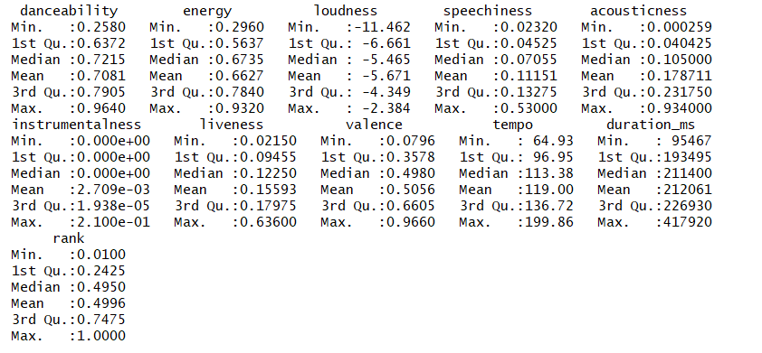
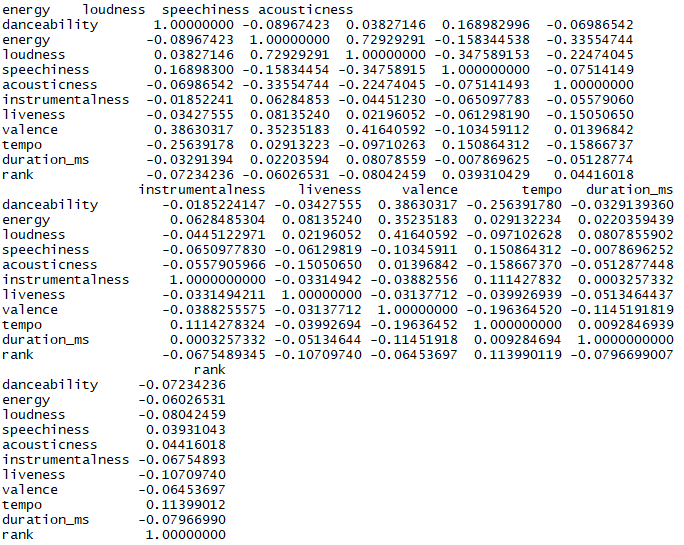
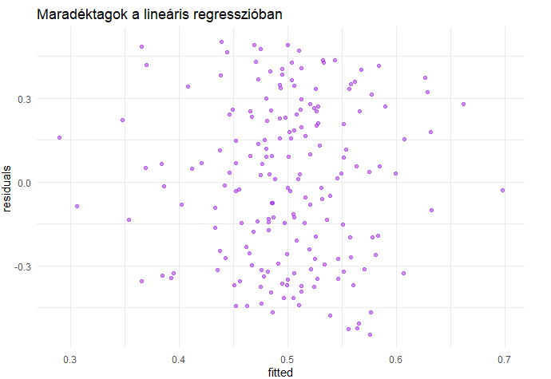
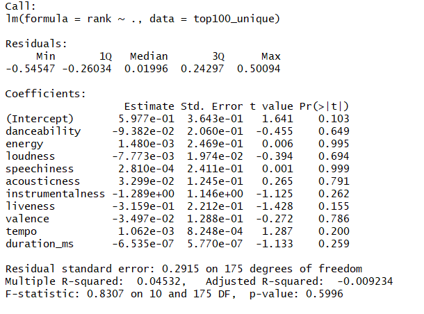
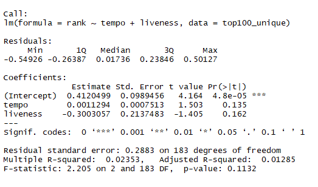

```{r setup, include=FALSE}
library(data.table)
library(ggplot2)
library(magrittr)
library(glue)
library(purrr)
library(caret)
library(knitr)
library(ggpubr)
library(arm)
knitr::opts_chunk$set(echo = FALSE)
knitr::opts_chunk$set(message = FALSE)

```


## Az elemzés alapjai 

- <font size="5"> A spotify 2017-18-as top 100-as listájának adatait elemezzük, mely a rangsorolt dalok számtalan zenei jellemzőjét rögzíti (ezek rövid leírása később). </font>
- <font size="5">Azt szeretnénk megmagyarázni, hogy van-e összefüggés ezen jellemzők és a toplistán elfoglalt helyezés között. </font>
- <font size="5">Ezen kívül egy másik alternatív módszerünk, hogy megpróbáljuk leírni, hogy milyen paraméterekkel rendelkező dal kerülhet a toplistára. </font>


```{r}
top_2017 <- fread("data/top2017.csv", encoding = "UTF-8")
top_2018 <- fread("data/top2018.csv", encoding = "UTF-8")
top_2017[, rank:=(1:100)/100]
top_2018[, rank:=(1:100)/100]
```
## Adattisztítás

- Egyes változókat kiszedtünk, mert teljesen irreleváns volt a szerepltetésük (és az értelmük)

```{r, echo=TRUE}
top_2017[, c("id", "time_signature", "key", "mode"):=NULL]
top_2018[, c("id", "time_signature", "key", "mode"):=NULL]
```

## Változók jelentése

>- <font size="6"> danceability </font>
>- <font size="6">energy</font>
>- <font size="6">loudness</font>
>- <font size="6">spechiness</font>
>- <font size="6">acousticness</font>
>- <font size="6">instrumentalness</font>
>- <font size="6">valence</font>
>- <font size="6">tempo</font>
>- <font size="6">duration_ms</font>


## Évek összehasonlítása
- Az évek összehasonlítása néhány változó szerint azt mutatja, hogy nem különböznek igazán ezek az évek zenei stílusban.

```{r,comment="",message=FALSE}
acou1 <- ggplot(top_2017, aes(acousticness)) + geom_histogram() + labs(title = "2017")
acou2 <- ggplot(top_2018, aes(acousticness)) + geom_histogram()+ labs(title = "2018")
ggarrange(acou1, acou2)
```

***
```{r, comment="",message=FALSE}
dance1 <-ggplot(top_2017, aes(danceability)) + geom_histogram()+ labs(title = "2017")
dance2 <-ggplot(top_2018, aes(danceability)) + geom_histogram()+ labs(title = "2018")

ggarrange(dance1, dance2)
```


*** 

```{r, comment="", message=FALSE}
ggarrange(ggplot(top_2017, aes(tempo)) + geom_histogram() + labs(title = "2017"),ggplot(top_2018, aes(tempo)) + geom_histogram()+ labs(title = "2018"))
```


```{r}
top100_music_dt <- data.table(rbind(top_2017, top_2018))
```

## Adattisztítás vol. 2

-Néhány dal mindkét év toplistáján szerepelt, ezektől megtisztítottuk az adatokat

```{r, echo=TRUE}
top100_unique <- unique(top100_music_dt, by = "name")
```

## Néhány kezdeti ábra, summary

```{r, comment="", message=FALSE}
ggplot(top100_unique, aes(tempo, rank))+ geom_point()+geom_smooth()+ theme_minimal()
```

```{r ,comment="", message=FALSE, eval=FALSE}
summary(top100_unique)

```

## Summary(top100_unique)



***
```{r, comment="", message=FALSE}
ggplot(top100_unique, aes(danceability)) + geom_histogram()+ theme_minimal()
```


***
```{r, comment="", message=FALSE}
ggplot(top100_unique, aes(loudness))+ geom_histogram()+ theme_minimal()
```

***
```{r, comment="", message=FALSE}
ggplot(top100_unique, aes(speechiness))+ geom_histogram()+ theme_minimal()
```

***
```{r, comment="", message=FALSE}
ggplot(top100_unique, aes(valence))+ geom_histogram()+ theme_minimal()
```

***
```{r, comment="", message=FALSE}
ggplot(top100_unique, aes(liveness))+ geom_histogram()+ theme_minimal()
```

***
```{r, comment="", message=FALSE}
ggplot(top100_unique, aes(acousticness))+ geom_histogram()+ theme_minimal()
```

***
```{r, comment="", message=FALSE}
ggplot(top100_unique, aes(valence, rank))+ geom_point()+geom_smooth()
```

***
```{r, comment="", message=FALSE}
ggplot(top100_unique, aes(loudness, energy))+ geom_point()+geom_smooth()
```

```{r, comment="", message=FALSE, eval=FALSE}
cor(top100_unique[, c("artists", "name"):=NULL])
```
## Korrelációs mátrix


***
-Mint látható a korrelációs mátrixból és az ábrákból, a rank igazán semmivel sem korrelál, egyes más változók egymással viszont elég erősen.Ennek ellenére érdemesnek tartjuk továbbvinni ezt az elméletet és regressziót futtatni.

***
```{r, comment="", message=FALSE, eval=FALSE}
lm1 <- lm(rank ~ . , data = top100_unique)
residuals <- data.table(residuals = lm1$residuals, fitted = lm1$fitted.values)
ggplot(residuals, aes(fitted, residuals)) + geom_point(alpha = .5, colour="purple") + labs(title = "Maradéktagok a lineáris regresszióban") + theme_minimal()
```


- A maradéktagokat mutató ábra alapján az elmondható, hogy azok randomok, így nem maradt ki szisztematikus hatás.


```{r, comment="", message=FALSE, eval=FALSE}
summary(lm1)
```
## Summary (lm1)


- Ellenben a p (és t) értékekből látszik, hogy a modellünk egyik magyarázó változója sem szignifikáns (ami a korrelációs mátrixból sejthető volt)


## Summary (lm2)

```{r, comment="", message=FALSE, eval=FALSE}
lm2 <- lm(rank ~ tempo + liveness, data = top100_unique)
summary(lm2)
```
- Az új lineáris regresszióban benne hagytuk a teljes modellből (lm1) a két legkisebb p-értékű tagot, azonban ezek p-értéke és így szignifikanciája nem változott. A rank ezzel a két változóval korrelált leginkább kezdetben.
- Interakció hozzáadásának nem láttuk értelmét (nincs értelme ezen változók kombinálásának), viszont az egyértelmű, hogy a modellnek nincs magyarázóereje.
- (Természetesen előfordulhat, hogy meglévő változókon kívül igazából teljesen más tényezők magyarázzák a toplistás helyezést (ízlés, előadó hírneve, divat, előadóval kapcsolatos hírek és történések stb.).)

## Logit regresszió

```{r, comment="", message=FALSE, warning=FALSE, results='markup'}
logit_top <- glm(rank ~ acousticness + danceability + loudness + speechiness + liveness, data = top100_unique, family = "binomial")
summary(logit_top)

```


## Logit regresszió
```{r}
coefplot(logit_top, xlim = c(-6,4))
```

-<font size="2"> A logit regresszió is teljesen inszignifikáns modellt ad, így azt gondoljuk, hogy cross-validationnek nincs értelme (nem lehet trainelni az adatot, mert nincs értelmes modell). Helyette visszatérnénk a leíró értelmezéshez.</font> 

```{r, comment="", message=FALSE}
top50 <- top100_unique[rank<= 0.50]
top51_100 <- top100_unique[rank> 0.50]
```

```{r,comment="", message=FALSE}
top50_avg <- top50[, .(avg_dan = sum(danceability)/length(danceability))]
top50_sd <- top50[, .(sd_dan = sqrt((sum(danceability-sum(danceability)/length(danceability))^2)/length(danceability)))]
top50_final <- data.table(top50_avg, top50_sd, Category = "Top50")

top51_avg <- top51_100[, .(avg_dan = sum(danceability)/length(danceability))]
top51_sd <- top51_100[, .(sd_dan = sqrt((sum(danceability-sum(danceability)/length(danceability))^2)/length(danceability)))]
top51_final <- data.table(top51_avg, top51_sd, Category = "Top51-100")

top_dance <- rbind(top50_final, top51_final)
```

## Átlagok eltérése
```{r, comment="", message=FALSE}
top_dance %>%
    .[, CI_lower := avg_dan - (2 * sd_dan)] %>%
    .[, CI_higher := avg_dan + (2 * sd_dan)] %>%
    ggplot(.,aes(x = Category, y = avg_dan)) +
    geom_col() +
    geom_errorbar(aes(ymin = CI_lower, ymax = CI_higher), colour = "red")+ labs(title = "Danceability átlagok eltérése top50 és top51-100 között") + theme_minimal()
   
```

- <font size="3">A szórások nagyon kicsik, így a konfidenciaintervallum tulajdonképpen megegyezik az átlaggal. A két átlag szinte azonos, így a top50 első és második fele között nincs különbség a danceability tekintetében.</font> 